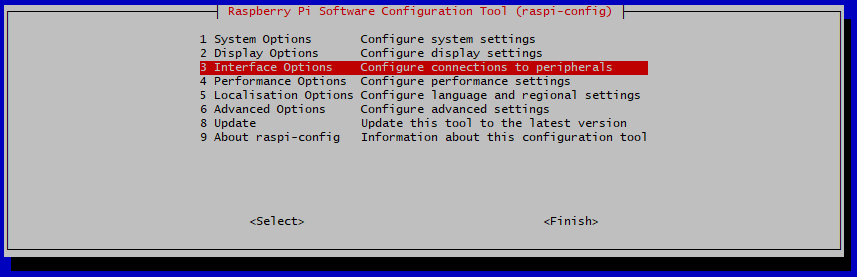
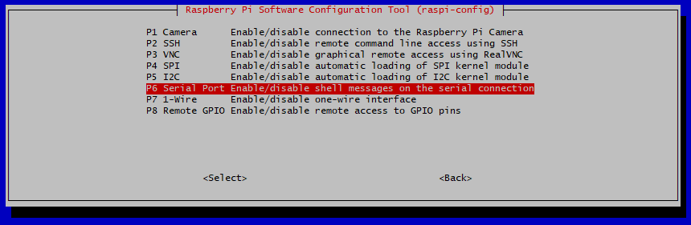
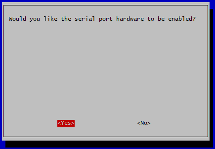
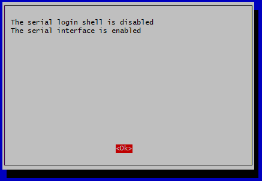

# RPI_operant
Raspberry Pi and python based operant

1. Use etcher to flash an SD card with the OS.
2. use setup wizard as normal. Set a new password. Enable SSH, enable I2C, and so forth
3. change the hostname to something informative. This name will be in the header of the email you receive (IE operant_pi_1, operant_pi_2, etc)
    1. edit /etc/hostname
        1. sudo nano /etc/hostname
    2. edit /etc/hosts
        1. sudo nano /etc/hosts
4. clone the RPI_operant repository
    1. git clone “https://github.com/dprotter/RPI_operant"
5. install dependencies by running setup.py
    1. sudo python3 setup.py install
6. duplicate the operant cage settings default file to a secure location on the pi
    1. sudo cp RPI_operant/home_base/operant_cage_settings_defaults.py /etc/RPI_operant/operant_cage_settings_local.py

# Setting up for Bonsai & Arduino

To get the pi setup to communicate with the Arduino there are a couple things you need to do. First, you must setup the serial communication interface within the Raspberry Pi.

Pull up the configuration through an ssh session with:

    sudo raspi-config

From there, press downward until you see the Interface Options selection.

Once selected, then scroll down to serial port options.

Select "NO" on allowing login over shell.

Select "YES" on allowing the hardware serial interface.

When done, you should see this confirmation screen and can exit out of the config options.

With these options selected, restart the pi to confirm these changes with:

    sudo reboot
