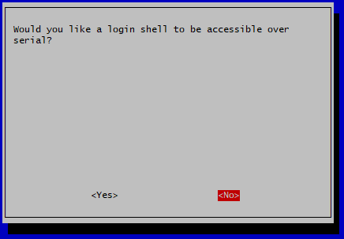

# RPI_operant
Raspberry Pi and python based operant

1. Use etcher to flash an SD card with the OS.
2. use setup wizard as normal. Set a new password. Enable SSH, enable I2C, and so forth
3. change the hostname to something informative. This name will be in the header of the email you receive (IE operant_pi_1, operant_pi_2, etc)
    1. edit /etc/hostname
        1. sudo nano /etc/hostname
    2. edit /etc/hosts
        1. sudo nano /etc/hosts
4. clone the RPI_operant repository
    1. git clone “https://github.com/dprotter/RPI_operant"
5. install dependencies by running setup.py
    1. sudo python3 setup.py install
6. duplicate the operant cage settings default file to a secure location on the pi
    1. sudo cp RPI_operant/home_base/operant_cage_settings_defaults.py /etc/RPI_operant/operant_cage_settings_local.py

# Setting up for Bonsai & Arduino

To get the pi setup to communicate with the Arduino there are a couple things you need to do. First, you must setup the serial communication interface within the Raspberry Pi.

Pull up the configuration through an ssh session with:

    sudo raspi-config

From there, press downward until you see the Interface Options selection.

Once selected, then scroll down to serial port options.

Select "NO" on allowing login over shell.

Select "YES" on allowing the hardware serial interface.

When done, you should see this confirmation screen and can exit out of the config options.

With these options selected, restart the pi to confirm these changes with:

    sudo reboot

As a final confirmation make sure that the serial0 port exists by using the follwing command:

    ls /dev

The /dev/serial0 port is the one that is connected to the Tx and Rx pins on the raspberry pi, which are the pins that will be connected to a software serial port on the Arduino.

## Arduino Setup

Once the pi is setup for serial communication, you must setup the Arduino to recieve the serial commands from the pi and then send the correct signal to the bonsai system.

The first step in this proccess is to connect the Arduino the PC with bonsai loaded onto it and load in the .ino script located at *commHandler-2.0/commHandler-2.0.ino*.

By default, this script sets up a software serial port to read info in using pins **2** and **3**. NOTE: these pins can always be changed in the script by changing the following two lines of code:

    int softRX = 2;
    int softTX = 3;

Since pin **2** is set up as the recieving pin, connect the **Tx** pin on the Pi to pin **2** on the Arduino. Since the Arduino will not be sending anything back to the Raspberry Pi, **DO NOT CONNECT PIN 3 TO RX ON THE PI**, doing so could short out the Pi as the Arduino send in 5V and the Pi recieves in 3.3V.

Finally, make sure that you have the SoftwareSerial Arduino library loaded on the Arduino from your PC. If you do not, simply install it using the library manager in the Arduino IDE app.

### Testing
To test the Arduino's command handling capabilities, look through the follwing lines of code in the *commandHandler-2.0.ino* lines of code to find which pins are set to output for the commands you want to test.

    byte pins[] = {13,10,9,4,5,6,7,11};

    int leverOutFoodPin      = pins[0];
    int leverOutPartnerPin   = pins[1];
    int leverOutNovelPin     = pins[2];
    int leverPressFoodPin    = pins[3];
    int leverPressPartnerPin = pins[4];
    int leverPressNovelPin   = pins[5];
    int enterPartnerPin      = pins[6];
    int enterNovelPin        = pins[7];
    int nullPin              = pins[8];

With the correct pin numbers located, connect that pin on the Arduino to a breadoard with a standard LED and a 220 Ohm resistor. 